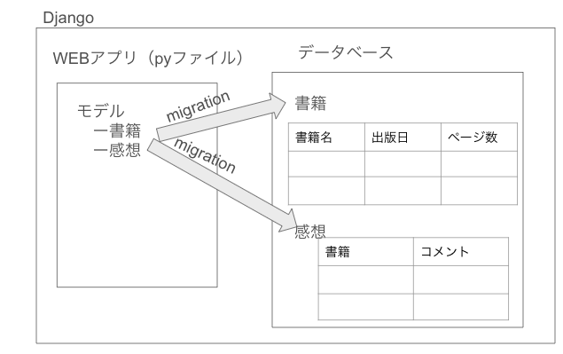

### 今回

- プロジェクトファイルをローカルに作成
  - `sanae/Documents/Python/files/2024MMDD.py`
  - PyCharm にて、フォルダを Open することで、実行環境となる
- [Qiita](https://qiita.com/kaki_k/items/7b178ad39394a031b50d#pycharm%E3%81%A7%E3%83%87%E3%83%90%E3%83%83%E3%82%B0%E5%AE%9F%E8%A1%8C%E3%81%99%E3%82%8B) は、マイグレーション実行まで

Django の中の世界の概念図

`makemigrations`: マイグレーションするためのファイルを`migrations`配下に生成するためのコマンド  
`migrate`: 実際にマイグレーションを行うコマンド。データベースに、model でのデータ定義を反映させる

### 次回

- [宿題](../20240113_15回目/20240113に向けた宿題.md)とく
- PyCharm とく
